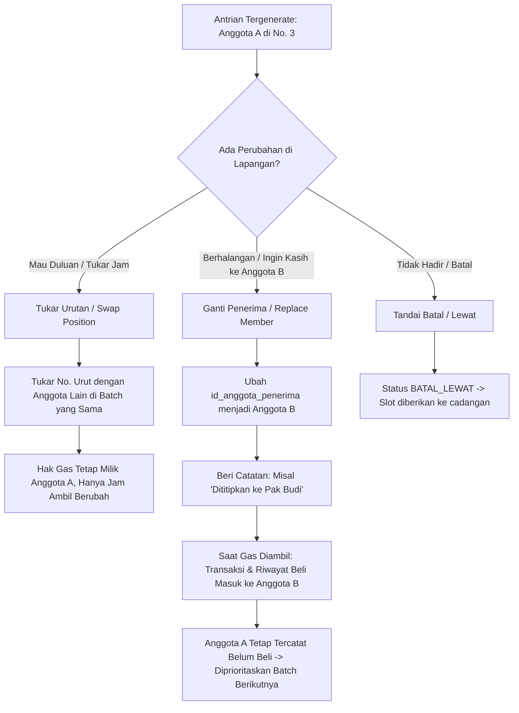

# Rancangan Sistem Aplikasi Penjualan Gas LPG Koperasi Desa Merah Putih (KDMP) Desa Gulun

Dokumen perancangan lengkap sistem antrian bergilir berkeadilan, pencatatan transaksi, portal beranda publik, dashboard laporan transparansi, notifikasi WhatsApp, dan integrasi Agen AI (MCP Server) untuk Koperasi Desa Merah Putih (KDMP) Desa Gulun.

---

## 1. Ringkasan Kebutuhan & Parameter Operasional

- **Organisasi**: Koperasi Desa Merah Putih (KDMP) Desa Gulun, Kec. Maospati, Kab. Magetan
- **Total Anggota**: ± 150 Orang
- **Alokasi Pasokan Gas**: 100 Tabung per Bulan
- **Jadwal Pengiriman Pangkalan**: 25 Tabung setiap hari Jumat Sore (4 Batch per bulan: 4 x 25 = 100 tabung)
- **Tantangan Utama**: Pasokan (100 tabung) lebih sedikit dari kebutuhan anggota (150 orang), sehingga memerlukan:
  1. Mekanisme antrian bergilir yang adil (**Fair Rotation Queue**) berbasis riwayat pembelian bulanan & kumulatif.
  2. Tombol sekali klik untuk **Generate Antrian Otomatis** 25 anggota saat pasokan gas tiba setiap Jumat sore.
  3. **Portal Beranda & Transparansi Publik**: Warga dapat mengecek nomor antrian, jadwal batch per-Jumat, dan rekap penerimaan gas secara terbuka tanpa harus login.
  4. **Notifikasi WhatsApp Ganda**: Pengumuman grup massal (1-klik salin teks pengumuman) dan pengingat personal per warga via tombol `📱 WA` dengan pencatatan timestamp otomatis.
  5. **Fleksibilitas di Lapangan**: Penanganan tukar nomor urut (*swap position*), pengalihan jatah/titip (*replace member*), dan kasir cepat 1-klik (*confirm pickup*).
  6. **Pengaturan Dinamis & Keamanan**: Harga tabung dan kuota tersimpan di sheet `PENGATURAN`, serta perlindungan akses pengurus menggunakan autentikasi PIN Admin (`ADMIN_PIN`).
  7. **Integrasi AI Agent (MCP Server)**: Kontrol dan monitoring pangkalan melalui Agen AI (Antigravity, Claude, Cursor) via protokol Model Context Protocol (TypeScript & Python).
- **Basis Teknologi**:
  - **Database**: Google Spreadsheet
  - **Frontend & Backend**: Google Apps Script (GAS) Web App (HTML Service, Modern CSS, Vanilla JS SPA)
  - **AI Integration**: Model Context Protocol (MCP) Server (Node.js/TypeScript & Python FastMCP)

---

## 2. Struktur Database (Google Spreadsheet)

Database menggunakan satu file Google Spreadsheet dengan 5 lembar kerja (Sheets):

```
Google Spreadsheet Database: [KDMP_Desa_Gulun_Gas_LPG]
 ├── ANGGOTA (Data master anggota & riwayat akumulasi)
 ├── BATCH_PENGIRIMAN (Data pengiriman 25 tabung tiap Jumat)
 ├── ANTRIAN_DISTRIBUSI (Data slot antrian 1-25 per batch, penyesuaian lapangan & log WA)
 ├── TRANSAKSI_PENJUALAN (Catatan penjualan riil saat gas diambil & dibayar)
 └── PENGATURAN (Konfigurasi kuota batch, harga dinamis, PIN admin & profil koperasi)
```

### Rincian Kolom Setiap Sheet:

#### 1. Sheet `ANGGOTA`
| Kolom | Tipe Data | Deskripsi |
| :--- | :--- | :--- |
| `id_anggota` | String (PK) | Contoh: `MBR-001` s/d `MBR-150` |
| `no_ktp` | String | Nomor NIK KTP |
| `no_kk` | String | Nomor Kartu Keluarga |
| `nama_lengkap` | String | Nama lengkap anggota |
| `rt_rw` | String | Contoh: `RT 02 / RW 01` |
| `no_whatsapp` | String | Nomor kontak WhatsApp untuk notifikasi |
| `status_aktif` | Enum | `AKTIF` / `NONAKTIF` |
| `total_beli_kumulatif`| Integer | Total tabung yang pernah dibeli seumur hidup |
| `total_beli_bulan_ini`| Integer | Total tabung yang dibeli pada bulan berjalan |
| `tgl_terakhir_beli` | Datetime | Waktu terakhir kali anggota mengambil gas |
| `catatan` | String | Keterangan tambahan (pekerjaan, JK, sumber data referensi) |

#### 2. Sheet `BATCH_PENGIRIMAN`
| Kolom | Tipe Data | Deskripsi |
| :--- | :--- | :--- |
| `id_batch` | String (PK) | Contoh: `BATCH-20260821-01` |
| `tgl_jadwal` | Date | Tanggal kedatangan gas (Jumat, format: `YYYY-MM-DD`) |
| `hari` | String | Default: `Jumat` |
| `waktu_kirim` | String | Default: `16:00 WIB` |
| `jumlah_stok` | Integer | Default: `25` |
| `jumlah_terambil` | Integer | Jumlah tabung yang sudah diambil pembeli |
| `sisa_stok` | Integer | `jumlah_stok - jumlah_terambil` |
| `status_batch` | Enum | `DRAFT`, `ANTRIAN_SIAP`, `DISTRIBUSI_BERJALAN`, `SELESAI` |

#### 3. Sheet `ANTRIAN_DISTRIBUSI`
| Kolom | Tipe Data | Deskripsi |
| :--- | :--- | :--- |
| `id_antrian` | String (PK) | Contoh: `Q-20260821-001` |
| `id_batch` | String (FK) | Relasi ke `BATCH_PENGIRIMAN` |
| `no_urut` | Integer | Nomor antrian `1` s/d `25` |
| `id_anggota_asli` | String (FK) | Anggota yang mendapatkan giliran otomatis |
| `id_anggota_penerima` | String (FK) | Anggota aktual pengambil (jika terjadi tukar/ganti) |
| `status_antrian` | Enum | `MENUNGGU`, `SUDAH_DIAMBIL`, `DIGANTIKAN`, `DITUKAR_URUTAN`, `BATAL_LEWAT` |
| `keterangan_penyesuaian` | String | Alasan ganti orang / tukar giliran / titip |
| `waktu_generate` | Datetime | Waktu antrian dibuat |
| `waktu_ambil` | Datetime | Waktu aktual pengambilan fisik tabung |
| `waktu_terakhir_wa` | Datetime | Waktu pengiriman pesan pengingat WhatsApp personal |

#### 4. Sheet `TRANSAKSI_PENJUALAN`
| Kolom | Tipe Data | Deskripsi |
| :--- | :--- | :--- |
| `id_transaksi` | String (PK) | Contoh: `TRX-20260821-001` |
| `id_antrian` | String (FK) | Relasi ke `ANTRIAN_DISTRIBUSI` |
| `id_batch` | String (FK) | Relasi ke `BATCH_PENGIRIMAN` |
| `id_anggota` | String (FK) | Relasi ke `ANGGOTA` aktual pembeli |
| `tgl_waktu_transaksi`| Datetime | Waktu bayar dan ambil |
| `jumlah_tabung` | Integer | Default: `1` |
| `harga_per_tabung`| Integer | Contoh: `Rp 20.000` (mengikuti konfigurasi database) |
| `total_bayar` | Integer | `jumlah_tabung * harga_per_tabung` |
| `metode_bayar` | Enum | `TUNAI`, `QRIS`, `TRANSFER` |
| `nama_pengambil` | String | Nama yang mengambil fisik gas di lokasi |
| `petugas_pencatat`| String | Nama petugas koperasi yang melayani |

#### 5. Sheet `PENGATURAN`
| Kunci | Nilai Default | Deskripsi |
| :--- | :--- | :--- |
| `NAMA_KOPERASI` | `Koperasi Desa Merah Putih (KDMP) Desa Gulun` | Nama resmi koperasi |
| `KUOTA_PER_BATCH` | `25` | Kuota tabung per pengiriman Jumat |
| `HARGA_PER_TABUNG`| `20000` | Harga resmi per tabung gas 3kg |
| `ATURAN_ROTASI` | `FAIR_PRIORITY_ROUND_ROBIN` | Algoritma rotasi antrian |
| `ADMIN_PIN` | `123456` | PIN keamanan akses panel pengurus |

---

## 3. Logika & Algoritma Antrian Berkeadilan (Smart Fair Rotation)

Koperasi memiliki 150 anggota dengan kuota 100 tabung per bulan (dibagi 4 Jumat @ 25 tabung). Dalam sebulan, ada 50 anggota yang belum dapat dan akan mendapatkan giliran utama pada awal bulan berikutnya.

### Algoritma Pemilihan 25 Anggota:
1. **Filter Anggota Aktif**: Ambil semua baris di sheet `ANGGOTA` dengan `status_aktif == 'AKTIF'`.
2. **Kriteria Pengurutan (Multi-tier Priority Scoring)**:
   - **Tingkat 1**: `total_beli_bulan_ini` (**Ascending**). Anggota yang bulan ini belum pernah membeli (0 tabung) diprioritaskan sebelum yang sudah pernah dapat (1 tabung).
   - **Tingkat 2**: `tgl_terakhir_beli` (**Ascending, nilai kosong / paling lampau didahulukan**). Anggota yang paling lama tidak membeli gas akan ditempatkan di nomor antrian teratas.
   - **Tingkat 3**: `total_beli_kumulatif` (**Ascending**). Anggota dengan akumulasi seumur hidup lebih sedikit diprioritaskan.
   - **Tingkat 4**: `id_anggota` (**Ascending / Deterministik**).
3. **Slice Kuota**: Ambil 25 anggota peringkat teratas.
4. **Generate Antrian**: Simpan ke sheet `ANTRIAN_DISTRIBUSI` dengan status `MENUNGGU`.

```
Simulasi Siklus Distribusi Bulanan:
- Jumat 1 (Minggu I)  : 25 Anggota (Batch 1: No. 1 - 25)
- Jumat 2 (Minggu II) : 25 Anggota (Batch 2: No. 26 - 50)
- Jumat 3 (Minggu III): 25 Anggota (Batch 3: No. 51 - 75)
- Jumat 4 (Minggu IV) : 25 Anggota (Batch 4: No. 76 - 100)
Total 100 anggota terlayani bulan berjalan.
-> Awal Bulan Berikutnya: 50 Anggota (No. 101 - 150) otomatis masuk antrian Batch 1 & 2 bulan berikutnya
   karena memiliki total_beli_bulan_ini = 0 dan tanggal terakhir beli paling lampau!
```

---

## 4. Penanganan Fleksibilitas di Lapangan & Kasir Cepat

Sistem dirancang fleksibel terhadap dinamika lapangan tanpa merusak integritas pelaporan data:



### Fitur Transaksi & Kasir:
- **Kasir 1-Klik (`confirmPickupAndPayment`)**: Menyerahkan gas, mencatat metode bayar (TUNAI, QRIS, TRANSFER), memotong stok batch, dan menambah kuota beli pembeli riil.
- **Harga Otomatis Terhubung Database**: Nilai transaksi otomatis menggunakan konfigurasi harga dari database settings (`HARGA_PER_TABUNG`).

---

## 5. Portal Beranda Publik, Notifikasi WhatsApp & Dashboard Transparansi

Aplikasi dilengkapi dua tingkat visibilitas: **Mode Publik Terbuka** (warga) dan **Mode Pengurus Admin** (login PIN).

### 1. Portal Beranda & Info Publik (`PublicHomeView.html`)
- **Akses Langsung Tanpa Login**: Warga dapat langsung membuka URL Web App untuk melihat pengumuman jadwal distribusi gas Jumat sore.
- **Kartu Ringkasan Real-Time**: Tanggal batch aktif, sisa stok tabung, realisasi kuota bulanan, dan total warga terlayani.
- **Filter Batch per-Jumat & Pencarian Mandiri**: Warga dapat mengetikkan nama untuk mencari nomor antriannya atau memilih riwayat batch Jumat sebelumnya via dropdown.
- **Ketentuan & Tata Cara Pengambilan**: Panduan membawa tabung kosong, uang pas (harga dinamis), dan konfirmasi penyerahan.

### 2. Fitur Notifikasi WhatsApp (Massal & Personal)
- **Salin Teks WA Massal**: Menghasilkan draf pengumuman resmi lengkap dengan daftar 25 nama, nomor urut, waktu pengambilan, dan tautan publik untuk disebarkan ke grup WA Desa Gulun.
- **Pengingat WhatsApp Personal (`sendPersonalWaReminder`)**: Tombol `📱 WA` di setiap kartu antrian yang otomatis membuka tautan WhatsApp (`wa.me/62...`) berisikan pesan personal ramah warga (nama, nomor antrian, hari, jam kedatangan, dan harga).
- **Pelacakan Log WA (`recordWaSent`)**: Sistem mencatat tanggal dan jam pengiriman WA pada kolom ke-10 sheet `ANTRIAN_DISTRIBUSI` dan menampilkan badge waktu di kartu antrian pengurus.

### 3. Dashboard Laporan & Rekapitulasi (`DashboardView.html`)
- **Tampilan Publik & Privasi**: Warga dapat memantau transparansi status penerimaan gas (siapa yang sudah dapat vs belum dapat). Kolom nomor WhatsApp dan tombol unduh CSV disembunyikan secara otomatis untuk menjaga privasi data warga.
- **Mode Admin**: Saat pengurus login dengan PIN, kolom kontak WhatsApp dan tombol ekspor CSV laporan akan aktif dan dapat diunduh.

---

## 6. Integrasi AI Agent (Model Context Protocol / MCP Server)

Sistem menyediakan **MCP Server** lengkap (tersedia dalam TypeScript/Node.js dan Python FastMCP) sehingga pengurus atau teknisi dapat mengoperasikan seluruh sistem pangkalan melalui percakapan bahasa alami pada Agen AI (Antigravity, Claude Desktop, Cursor).

### Daftar 12 Tools MCP yang Disediakan:

| No | Nama Tool MCP | Parameter | Fungsi |
| :-: | :--- | :--- | :--- |
| 1 | `get_dashboard_analytics` | - | Mengambil ringkasan KPI, total anggota terlayani, dan sisa kuota bulanan dari 100 tabung |
| 2 | `get_current_batches` | - | Melihat daftar jadwal batch kedatangan Jumat sore beserta status stok |
| 3 | `create_new_batch` | `tglJadwal`, `waktuKirim`, `jumlahStok` | Membuat jadwal batch pengiriman baru untuk hari Jumat |
| 4 | `generate_queue_batch` | `batchId`, `quotaLimit` | Meng-generate 25 antrian otomatis berbasis algoritma prioritas berkeadilan |
| 5 | `get_batch_queue` | `batchId` | Melihat daftar 25 nama anggota antrian, nomor urut, dan status pengambilan |
| 6 | `swap_queue_position` | `queueId1`, `queueId2` | Menukar posisi nomor urut antara 2 antrian di lapangan |
| 7 | `replace_queue_member` | `queueId`, `newMemberId`, `reason` | Mengalihkan jatah antrian ke anggota pengganti dan mencatat riwayat ke pembeli aktual |
| 8 | `confirm_gas_pickup` | `queueId`, `paymentMethod`, `collectorName`, `price` | Kasir 1-klik: konfirmasi fisik gas telah diambil dan dibayar |
| 9 | `get_member_purchase_report` | `search`, `unservedOnly` | Mencari data anggota, riwayat beli kumulatif/bulanan, atau memfilter yang belum pernah dapat |
| 10 | `register_new_member` | `nama_lengkap`, `no_ktp`, `rt_rw`, `no_whatsapp` | Mendaftarkan warga baru ke master database anggota |
| 11 | `sync_reference_members` | - | Mengimpor 150 data anggota dari sheet `template_simkopdes` pada spreadsheet referensi secara aman |
| 12 | `record_wa_sent` | `queueId` | Mencatat waktu pengiriman WhatsApp pengingat pada slot antrian tertentu |

---

## 7. Arsitektur File Proyek

```
c:\xampp\htdocs\google_apps_script\
│
├── RANCANGAN_SISTEM_GAS_KDMP.md  # Dokumen rancangan komprehensif sistem (file ini)
├── appsscript.json               # Manifest konfigurasi Google Apps Script
│
├── docs/                         # Panduan Penggunaan & Panduan Teknis
│   ├── PANDUAN_OPERASIONAL.md    # SOP operasional bagi pengurus koperasi & kasir
│   └── SETUP_GOOGLE_APPS_SCRIPT.md # Panduan instalasi dan deployment Web App
│
├── src/                          # File Source Code Google Apps Script
│   ├── Code.gs                   # Backend controller utama, setup database, auth PIN & router
│   ├── ServiceMember.gs          # Layanan master data anggota, reset kuota bulanan & import
│   ├── ServiceQueue.gs           # Smart Queue Generator, swap antrian, ganti penerima & log WA
│   ├── ServiceTransaction.gs     # Pencatatan transaksi penjualan, kasir cepat & update stok
│   ├── ServiceReport.gs          # Analitik KPI dashboard, breakdown RT/RW & laporan rekap
│   ├── Api.gs                    # REST API Router (GET & POST) untuk integrasi MCP Server
│   │
│   └── views/                    # Komponen Tampilan Web App (HTML Service)
│       ├── Index.html            # Kerangka utama Single Page Application (SPA) & Modal Login
│       ├── Header.html           # Navbar aplikasi: tab publik, tab admin & status login
│       ├── PublicHomeView.html   # Beranda publik warga, jadwal batch Jumat & filter antrian
│       ├── QueueView.html        # Panel Antrian Admin: Generate 25, kasir, swap & WA personal
│       ├── DashboardView.html    # Panel Laporan Rekap: KPI kuota, filter status & unduh CSV
│       ├── MemberView.html       # Master Data Anggota: CRUD anggota, import referensi & reset
│       ├── Style.html            # Desain CSS modern, mobile responsive, tema Merah Putih
│       └── Script.html           # Logika interaktif frontend (SPA, AJAX Apps Script & WA)
│
└── mcp_server/                   # MCP Server untuk Agen AI (Antigravity, Claude, Cursor)
    ├── package.json              # Konfigurasi Node.js & dependencies MCP SDK
    ├── tsconfig.json             # Konfigurasi TypeScript
    ├── server.py                 # MCP Server versi Python FastMCP
    ├── antigravity_mcp_config.json # Konfigurasi MCP siap pakai untuk Antigravity IDE
    ├── .env.example              # Template variabel lingkungan URL Web App
    ├── README.md                 # Petunjuk integrasi dan daftar tools MCP
    └── src/
        └── index.ts              # MCP Server versi TypeScript / Node.js
```

---

## 8. Ringkasan Fitur Unggulan Sistem

1. **Smart Fair Rotation (Anti-Monopoli Kuota)**: Menjamin seluruh 150 anggota mendapatkan giliran secara merata dalam rotasi bulanan 100 tabung.
2. **Keterbukaan Publik & Perlindungan Privasi**: Warga dapat melihat status antrian secara transparan di beranda publik tanpa login, namun data kontak pribadi (WhatsApp) tetap aman terlindungi di balik PIN Admin pengurus.
3. **Pengingat WhatsApp Otomatis**: Integrasi pengumuman grup desa dan pesan pengingat personal satu-per-satu langsung ke kontak warga.
4. **Fleksibilitas Pangkalan**: Memfasilitasi pertukaran nomor urut jam kedatangan dan pelimpahan jatah titip tanpa mengacaukan pembukuan kuota.
5. **AI-Ready Architecture**: Siap diperintahkan dan dipantau 100% secara instan lewat Model Context Protocol (MCP) Server.

