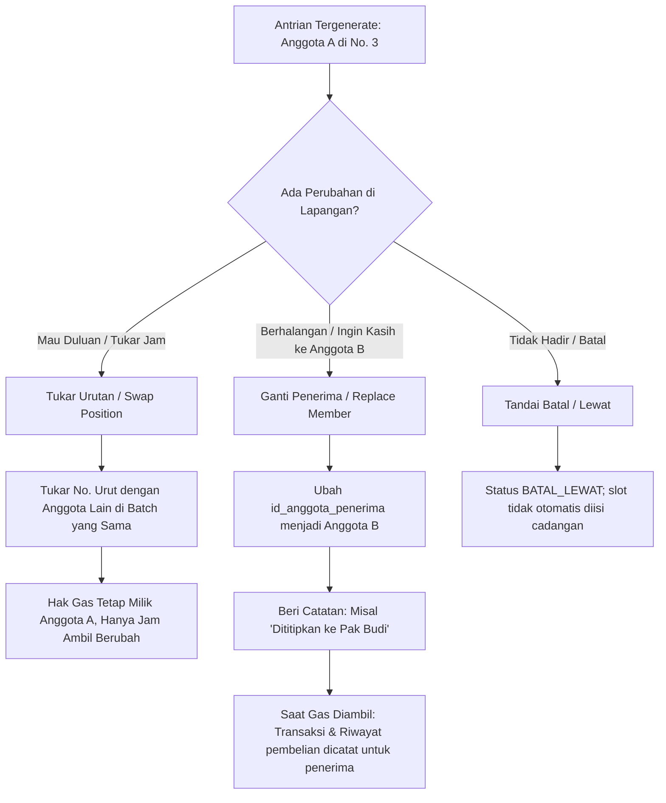

# Sistem Distribusi Gas LPG KDMP Desa Gulun

Aplikasi Google Apps Script untuk mengelola anggota, jadwal pasokan LPG, antrian distribusi, transaksi penjualan, laporan, dan integrasi AI melalui MCP Server. Dokumen ini menjelaskan fitur yang tersedia pada kode di repository; beberapa batasan implementasi dicatat agar tidak disalahartikan sebagai jaminan sistem.

---

## 1. Ringkasan Kebutuhan & Parameter Operasional

- **Organisasi**: Koperasi Desa Merah Putih (KDMP) Desa Gulun, Kec. Maospati, Kab. Magetan
- **Total Anggota**: ± 150 Orang
- **Alokasi Pasokan Gas**: 100 Tabung per Bulan
- **Contoh jadwal operasional**: 25 tabung setiap Jumat sore (empat batch per bulan); jumlah aktual dapat disesuaikan.
- **Alur distribusi**: Kuota dan jadwal dapat disesuaikan. Nilai default yang digunakan sistem adalah 25 tabung per batch, dengan pemilihan anggota berdasarkan riwayat pembelian bulanan, tanggal pembelian terakhir, total pembelian kumulatif, dan ID anggota.
  1. Pengurus membuat batch dan menjalankan **Generate Antrian** sesuai kuota batch.
  2. Transaksi pengambilan memperbarui stok batch serta riwayat pembelian anggota.
- **Beranda dan laporan**: Menampilkan ringkasan distribusi, batch, pencarian antrian, dan laporan anggota.
- **WhatsApp**: Membuat draf pesan personal untuk dibuka di WhatsApp serta menyalin teks pengumuman grup. Aplikasi tidak mengirim pesan WhatsApp secara otomatis; pencatatan waktu adalah log tindakan dari aplikasi, bukan konfirmasi bahwa pesan terkirim.
- **Penyesuaian lapangan**: Menukar urutan, mengganti penerima, menandai antrian batal/lewat, serta mencatat pengambilan dan pembayaran.
- **Pengaturan**: Data koperasi, harga, kuota, logo, dan PIN admin dikelola melalui aplikasi/database.
- **Integrasi AI Agent (MCP Server)**: MCP Server TypeScript/Node.js dan Python menyediakan tools untuk pemantauan dan operasi sistem.
- **Basis Teknologi**:
  - **Database**: Google Spreadsheet
  - **Frontend & Backend**: Google Apps Script (GAS) Web App (HTML Service, Modern CSS, Vanilla JS SPA)
  - **AI Integration**: Model Context Protocol (MCP) Server (Node.js/TypeScript & Python FastMCP)

---

## 2. Struktur Database (Google Spreadsheet)

Database menggunakan satu file Google Spreadsheet dengan 5 lembar kerja (Sheets):

```
Google Spreadsheet Database: [KDMP_Desa_Gulun_Gas_LPG]
 ├── ANGGOTA (Data master anggota & riwayat akumulasi)
 ├── BATCH_PENGIRIMAN (Data pengiriman 25 tabung tiap Jumat)
  ├── ANTRIAN_DISTRIBUSI (Data slot antrian per batch, penyesuaian lapangan & log tindakan WA)
 ├── TRANSAKSI_PENJUALAN (Catatan penjualan riil saat gas diambil & dibayar)
  └── PENGATURAN (Konfigurasi kuota batch, harga, PIN admin & profil koperasi)
```

### Rincian Kolom Setiap Sheet:

#### 1. Sheet `ANGGOTA`
| Kolom | Tipe Data | Deskripsi |
| :--- | :--- | :--- |
| `id_anggota` | String (PK) | Contoh: `MBR-001` s/d `MBR-150` |
| `no_ktp` | String | Nomor NIK KTP |
| `no_kk` | String | Nomor Kartu Keluarga |
| `nama_lengkap` | String | Nama lengkap anggota |
| `rt_rw` | String | Contoh: `RT 02 / RW 01` |
| `no_whatsapp` | String | Nomor kontak WhatsApp untuk notifikasi |
| `status_aktif` | Enum | `AKTIF` / `NONAKTIF` |
| `total_beli_kumulatif`| Integer | Total tabung yang pernah dibeli seumur hidup |
| `total_beli_bulan_ini`| Integer | Total tabung yang dibeli pada bulan berjalan |
| `tgl_terakhir_beli` | Datetime | Waktu terakhir kali anggota mengambil gas |
| `catatan` | String | Keterangan tambahan (pekerjaan, JK, sumber data referensi) |
| `alasan_keluar` | String | Alasan keluar anggota; anggota beralasan keluar dari impor ditandai `NONAKTIF` |

#### 2. Sheet `BATCH_PENGIRIMAN`
| Kolom | Tipe Data | Deskripsi |
| :--- | :--- | :--- |
| `id_batch` | String (PK) | Contoh: `BATCH-20260821-01` |
| `tgl_jadwal` | Date | Tanggal kedatangan gas (Jumat, format: `YYYY-MM-DD`) |
| `hari` | String | Default: `Jumat` |
| `waktu_kirim` | String | Default: `16:00 WIB` |
| `jumlah_stok` | Integer | Default: `25` |
| `jumlah_terambil` | Integer | Jumlah tabung yang sudah diambil pembeli |
| `sisa_stok` | Integer | `jumlah_stok - jumlah_terambil` |
| `status_batch` | Enum | `DRAFT`, `ANTRIAN_SIAP`, `DISTRIBUSI_BERJALAN`, `SELESAI` |

#### 3. Sheet `ANTRIAN_DISTRIBUSI`
| Kolom | Tipe Data | Deskripsi |
| :--- | :--- | :--- |
| `id_antrian` | String (PK) | Contoh: `Q-20260821-001` |
| `id_batch` | String (FK) | Relasi ke `BATCH_PENGIRIMAN` |
| `no_urut` | Integer | Nomor antrian `1` s/d `25` |
| `id_anggota_asli` | String (FK) | Anggota yang mendapatkan giliran otomatis |
| `id_anggota_penerima` | String (FK) | Anggota aktual pengambil (jika terjadi tukar/ganti) |
| `status_antrian` | Enum | `MENUNGGU`, `SUDAH_DIAMBIL`, `DIGANTIKAN`, `DITUKAR_URUTAN`, `BATAL_LEWAT` |
| `keterangan_penyesuaian` | String | Alasan ganti orang / tukar giliran / titip |
| `waktu_generate` | Datetime | Waktu antrian dibuat |
| `waktu_ambil` | Datetime | Waktu aktual pengambilan fisik tabung |
| `waktu_terakhir_wa` | Datetime | Waktu pengiriman pesan pengingat WhatsApp personal |
| `map_atas_nama` | String | Nama yang digunakan pada catatan MAP untuk slot antrian |
| `map_diperbarui_pada` | Datetime | Waktu terakhir catatan MAP diubah |
| `map_anggota_id` | String | ID anggota koperasi yang dipilih sebagai nama pada MAP |
| `map_nama_snapshot` | String | Snapshot nama anggota yang dipilih saat catatan MAP disimpan |

#### 4. Sheet `TRANSAKSI_PENJUALAN`
| Kolom | Tipe Data | Deskripsi |
| :--- | :--- | :--- |
| `id_transaksi` | String (PK) | Contoh: `TRX-20260821-001` |
| `id_antrian` | String (FK) | Relasi ke `ANTRIAN_DISTRIBUSI` |
| `id_batch` | String (FK) | Relasi ke `BATCH_PENGIRIMAN` |
| `id_anggota` | String (FK) | Relasi ke `ANGGOTA` aktual pembeli |
| `tgl_waktu_transaksi`| Datetime | Waktu bayar dan ambil |
| `jumlah_tabung` | Integer | Default: `1` |
| `harga_per_tabung`| Integer | Contoh: `Rp 20.000` (mengikuti konfigurasi database) |
| `total_bayar` | Integer | `jumlah_tabung * harga_per_tabung` |
| `metode_bayar` | Enum | `TUNAI`, `QRIS`, `TRANSFER` |
| `nama_pengambil` | String | Nama yang mengambil fisik gas di lokasi |
| `petugas_pencatat`| String | Nama petugas koperasi yang melayani |

#### 5. Sheet `PENGATURAN`
| Kunci | Nilai Default | Deskripsi |
| :--- | :--- | :--- |
| `NAMA_KOPERASI` | `Koperasi Desa Merah Putih (KDMP) Desa Gulun` | Nama resmi koperasi |
| `KUOTA_PER_BATCH` | `25` | Kuota tabung per pengiriman Jumat |
| `HARGA_PER_TABUNG`| `20000` | Harga resmi per tabung gas 3kg |
| `ATURAN_ROTASI` | `FAIR_PRIORITY_ROUND_ROBIN` | Algoritma rotasi antrian |
| `TAMPILKAN_TOTAL_KUMULATIF` | `false` | Admin dapat memilih apakah total pembelian kumulatif tampil pada laporan publik |
| `ADMIN_PIN` | `123456` | PIN keamanan akses panel pengurus |

---

## 3. Pemilihan Antrian

Kuota, jumlah anggota, dan frekuensi batch bergantung pada data operasional. Generator memilih anggota aktif dan memprioritaskan riwayat pembelian lebih rendah. Urutan pembanding yang digunakan adalah:

1. `total_beli_bulan_ini` menaik.
2. Tanggal pembelian terakhir yang paling lama terlebih dahulu.
3. `total_beli_kumulatif` menaik.
4. `id_anggota` sebagai pemutus seri deterministik.

Generator mengambil sejumlah anggota sesuai kuota yang diminta lalu menyimpan slot antrian dengan status `MENUNGGU`. Urutan ini membantu pemerataan berdasarkan data pembelian, tetapi bukan reservasi otomatis lintas beberapa batch yang dibuat sebelum transaksi batch sebelumnya dicatat.

Contoh operasional dapat menggunakan empat batch berkuota 25 tabung per bulan. Jumlah dan jadwal tersebut merupakan konfigurasi operasional, bukan batas tetap aplikasi.

---

## 4. Penanganan Fleksibilitas di Lapangan & Kasir Cepat

Sistem dirancang fleksibel terhadap dinamika lapangan tanpa merusak integritas pelaporan data:



### Fitur Transaksi & Kasir:
- **Konfirmasi pengambilan dan pembayaran (`confirmPickupAndPayment`)**: Mencatat pembeli/pengambil, metode bayar, transaksi, serta perubahan stok dan riwayat pembelian.
- **Harga dan kuota**: Pengurus dapat mengelola nilai konfigurasi aplikasi. Periksa nilai yang tampil sebelum mencatat transaksi.
- Aksi batal/lewat mengubah status slot; sistem tidak otomatis mengisi slot itu dengan anggota cadangan.
- Catatan “Kirim ke MAP” memungkinkan admin memilih anggota koperasi berdasarkan nama/NIK, lalu menyimpan ID anggota terpilih dan snapshot namanya sebagai metadata slot antrian di spreadsheet. NIK tetap berasal dari anggota penerima dan hanya ditampilkan pada UI admin. Belum ada pengiriman melalui API MAP eksternal.

---

## 5. Portal Beranda Publik, Notifikasi WhatsApp & Dashboard Transparansi

Aplikasi menyediakan tampilan publik dan panel pengurus. Endpoint/API dan pemanggilan fungsi Apps Script tetap perlu ditinjau terpisah dari tampilan antarmuka.

### 1. Beranda dan laporan
- Beranda menampilkan ringkasan distribusi, daftar batch, pencarian anggota/antrian, dan riwayat batch.
- Panel laporan menampilkan ringkasan pembelian dan status distribusi, termasuk filter dan ekspor yang tersedia bagi pengurus.
- Kolom **Total Kumulatif** pada laporan publik disembunyikan secara default. Admin dapat memilih tampil/sembunyi melalui **Setup & PIN → Tampilan Total Kumulatif**; saat disembunyikan, angka tersebut tidak dikirim oleh fungsi data anggota publik.
- Manifest mengizinkan akses anonim. Pada implementasi saat ini, sebagian tampilan memanggil fungsi Apps Script langsung dan responsnya dapat mencakup data anggota/antrian sensitif. Jangan publikasikan URL kepada pengguna umum sebelum pemeriksaan dan perbaikan otorisasi serta penyaringan data di server selesai. Menyembunyikan kolom di antarmuka bukan perlindungan data.

### 2. WhatsApp
- Aplikasi membuka tautan/draf WhatsApp personal dan menyediakan teks pengumuman grup untuk disalin.
- Aplikasi tidak mengirim pesan WhatsApp melalui API. Log waktu dicatat saat aksi pengingat dilakukan dan tidak memverifikasi status terkirim.

### 3. Admin dan anggota
- Login admin menggunakan PIN dan sesi; tersedia operasi pengelolaan anggota, reset kuota bulanan, impor anggota referensi, pengaturan identitas/logo, dan perubahan PIN.
- Impor anggota membaca ID spreadsheet dari Script Property `REFERENCE_SHEET_ID` dan membutuhkan akses akun yang menjalankan Apps Script. Kolom `Alasan Keluar` pada sumber menandai anggota `NONAKTIF`; alasannya bisa dilihat pada tooltip status dan diedit dari modal anggota.

---

## 6. Integrasi AI Agent (Model Context Protocol / MCP Server)

Sistem menyediakan MCP Server TypeScript/Node.js dan Python FastMCP untuk menghubungkan klien seperti Antigravity, Claude Desktop, atau Cursor ke endpoint Google Apps Script. Operasi yang memerlukan autentikasi harus dikonfigurasi dengan `GAS_API_KEY` yang cocok dengan Script Property API pada project GAS.

### Daftar 12 Tools MCP yang Disediakan:

| No | Nama Tool MCP | Parameter | Fungsi |
| :-: | :--- | :--- | :--- |
| 1 | `get_dashboard_analytics` | - | Mengambil ringkasan KPI, anggota terlayani, dan kuota |
| 2 | `get_current_batches` | - | Melihat daftar batch beserta status stok (pastikan versi MCP dan endpoint GAS kompatibel; periksa action API bila pemanggilan gagal) |
| 3 | `create_new_batch` | `tglJadwal`, `waktuKirim`, `jumlahStok` | Membuat jadwal batch pengiriman baru untuk hari Jumat |
| 4 | `generate_queue_batch` | `batchId`, `quotaLimit` | Membuat antrian sesuai kuota dengan prioritas berdasarkan riwayat pembelian |
| 5 | `get_batch_queue` | `batchId` | Melihat daftar anggota antrian, nomor urut, dan status pengambilan |
| 6 | `swap_queue_position` | `queueId1`, `queueId2` | Menukar posisi nomor urut antara 2 antrian di lapangan |
| 7 | `replace_queue_member` | `queueId`, `newMemberId`, `reason` | Mengubah anggota penerima slot |
| 8 | `confirm_gas_pickup` | `queueId`, `paymentMethod`, `collectorName`, `price` | Kasir 1-klik: konfirmasi fisik gas telah diambil dan dibayar |
| 9 | `get_member_purchase_report` | `search`, `unservedOnly` | Mencari data anggota, riwayat beli kumulatif/bulanan, atau memfilter yang belum pernah dapat |
| 10 | `register_new_member` | `nama_lengkap`, `no_ktp`, `rt_rw`, `no_whatsapp` | Mendaftarkan warga baru ke master database anggota |
| 11 | `sync_reference_members` | - | Mengimpor anggota dari sheet referensi yang dikonfigurasi |
| 12 | `record_wa_sent` | `queueId` | Mencatat waktu aksi pengingat WhatsApp pada slot antrian |

> MCP tool dan parameter tersedia dalam implementasi TypeScript dan Python. Pastikan `GAS_WEBAPP_URL` dan `GAS_API_KEY` terisi. Diketahui tool `get_current_batches` pada klien MCP mengirim action POST `getBatches`, sementara router POST GAS saat ini belum menangani action tersebut; tool itu perlu diperbaiki atau endpoint diselaraskan sebelum dipakai. Periksa kembali action lainnya terhadap versi GAS yang sedang dipublikasikan.

---

## 7. Deploy Google Apps Script dengan clasp

Deployment mengambil berkas GAS dari folder `src/`, sesuai `rootDir` pada `.clasp.json`.

### Persiapan pertama kali

1. Pasang Node.js dan npm, lalu pasang clasp:

  ```powershell
  npm install -g @google/clasp
  ```

2. Aktifkan Google Apps Script API pada pengaturan akun Google Apps Script.
3. Dari root repository, salin `.clasp.json.example` menjadi `.clasp.json`, lalu isi `scriptId` dengan ID project Apps Script dan pertahankan `rootDir` sebagai `./src`.
4. Login sekali dengan akun yang memiliki akses ke project:

  ```powershell
  clasp login
  ```

  File autentikasi clasp bersifat rahasia dan tidak boleh dimasukkan ke Git.

### Push dan buat versi

Jalankan perintah dari root repository:

```powershell
clasp status
clasp push
clasp version "Deskripsi perubahan"
```

Catat nomor versi yang ditampilkan oleh `clasp version`, lalu lihat ID deployment yang sudah ada:

```powershell
clasp deployments
```

### Perbarui deployment Web App yang sudah ada

Pilih ID deployment Web App yang sedang digunakan, kemudian gunakan nomor versi yang baru dibuat:

```powershell
clasp deploy -i "ID_DEPLOYMENT" -V NOMOR_VERSI -d "Deskripsi rilis"
```

Contoh:

```powershell
clasp deploy -i "AKfycb..." -V 16 -d "Perbaikan laporan"
clasp deployments
```

Pastikan keluaran deploy menyebut ID yang benar dan daftar deployment menunjukkan versi terbaru. Redeploy memakai ID deployment yang sama sehingga URL Web App tetap sama. Deployment `@HEAD` adalah deployment tanpa versi tetap; untuk rilis yang dipakai pengguna, gunakan deployment berversi yang memang menjadi URL produksi. Jangan memilih ID sebelum memastikan URL yang digunakan.

Untuk deployment pertama, buat deployment Web App dari Apps Script atau gunakan `clasp deploy` tanpa `-i`, lalu catat ID/URL yang dihasilkan. Periksa pengaturan **Execute as** dan **Who has access** di Apps Script. Manifest saat ini menggunakan `USER_DEPLOYING` dan `ANYONE_ANONYMOUS`; pastikan pengaturan akses sesuai kebijakan sebelum memublikasikan. Setelah perubahan berikutnya, ulangi `clasp push`, `clasp version`, lalu redeploy ID yang sama.

### Konfigurasi secret API

Tambahkan Script Property `API_SECRET_KEY` di **Apps Script → Project Settings → Script Properties**. Nilainya harus cocok dengan `GAS_API_KEY` pada konfigurasi MCP. Jangan menaruh key asli di README, `.clasp.json`, atau repository.

## 8. Arsitektur File Proyek

```
kdmp-gas-lpg/
│
├── README.md                     # Ringkasan fitur dan panduan deploy
├── .clasp.json.example           # Contoh konfigurasi clasp (isi scriptId sendiri)
├── src/                          # Root project Google Apps Script
│   ├── appsscript.json           # Manifest konfigurasi Google Apps Script
│   ├── Code.gs                   # Controller, database, autentikasi dan router
│   ├── ServiceMember.gs          # Data anggota, import dan reset bulanan
│   ├── ServiceQueue.gs           # Batch dan manajemen antrian
│   ├── ServiceTransaction.gs     # Transaksi dan pembaruan stok
│   ├── ServiceReport.gs          # Analitik dan laporan
│   ├── Api.gs                    # Router REST GET/POST untuk MCP
│   └── views/                    # Antarmuka HTML Service
│       ├── Index.html
│       ├── Header.html
│       ├── PublicHomeView.html
│       ├── QueueView.html
│       ├── DashboardView.html
│       ├── MemberView.html
│       ├── Style.html
│       └── Script.html
├── docs/
│   └── SETUP_GOOGLE_APPS_SCRIPT.md # Setup spreadsheet dan konfigurasi awal
└── mcp_server/                   # MCP Server TypeScript dan Python
  ├── package.json
  ├── server.py
  └── src/index.ts
```

## 9. Ringkasan Fitur

1. Pengelolaan batch, antrian, anggota, transaksi, dan laporan berbasis Google Sheets.
2. Pemilihan antrian berdasarkan riwayat pembelian anggota dan kuota batch.
3. Penyesuaian urutan/penerima, konfirmasi pengambilan, dan pencatatan tindakan WhatsApp.
4. Antarmuka Web App Google Apps Script dan integrasi melalui MCP Server.

